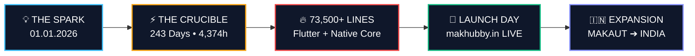

<div align="center">

<br/>


&nbsp;&nbsp;&nbsp;&nbsp;&nbsp;&nbsp;&nbsp;&nbsp;


# MAKHUBBY
### *The Student Operating Ecosystem*

```
   ███╗   ███╗ █████╗ ██╗  ██╗██╗  ██╗██╗   ██╗██████╗ ██████╗ ██╗   ██╗
   ████╗ ████║██╔══██╗██║ ██╔╝██║  ██║██║   ██║██╔══██╗██╔══██╗╚██╗ ██╔╝
   ██╔████╔██║███████║█████═╝ ███████║██║   ██║██████╔╝██████╔╝ ╚████╔╝ 
   ██║╚██╔╝██║██╔══██║██╔═██╗ ██╔══██║██║   ██║██╔══██╗██╔══██╗  ╚██╔╝  
   ██║ ╚═╝ ██║██║  ██║██║ ╚██╗██║  ██║╚██████╔╝██████╔╝██████╔╝   ██║   
   ╚═╝     ╚═╝╚═╝  ╚═╝╚═╝  ╚═╝╚═╝  ╚═╝ ╚═════╝ ╚═════╝ ╚═════╝    ╚═╝   
                  —  R I S I N G   F R O M   H E R E  —                 
```

**An Apple Keynote-style cinematic launch presentation engineered for live projection.**  
*Built for MAKAUT. Expanding to India. Powered by [Manikarnika Technologies](https://manikarnikatechnologies.in).*

<br/>

[](https://makhubby.in)
[](https://manikarnikatechnologies.in)
[](https://makhubby.in)
[](https://github.com/ABVicky/MakHubby-LAUNCH)

<br/>

> *"An idea → A problem → A decision → 243 days → 4,374 hours → 73,500+ lines of code → A product → A launch → MAKAUT to India."*

</div>

---

## 📽️ The Story in 4 Acts



### 📖 Narrative Blueprint

1. **Act I: The Spark & The Fracture (Scenes 01–03)**
   - January 1, 2026: College students were drowning in fragmented tools — scattered notes, buried notices, isolated peer networks.
   - One decision emerged: **BUILD IT.**
2. **Act II: The Relentless Crucible (Scenes 04–10)**
   - 243 days. 18 hours every single day. 15,746,400 measured seconds.
   - Crashes, bugs, architectural bottlenecks, and complete rewrites. We didn't quit — we re-engineered.
3. **Act III: The Breakthrough & The Identity (Scenes 11–13)**
   - `73,500+ lines of code` suddenly became more than a software repository — it became **MakHubby**.
   - Backed by the engineering muscle and vision of **Manikarnika Technologies**.
4. **Act IV: The Horizon (Scenes 14–20)**
   - MAKAUT was just the testing ground. The destination is connecting 40+ million college students across India.

---

## ⚡ Real Engineering Metrics

```
╔═════════════════════════════════════════════════════════════════════════╗
║                      THE BUILD BY THE NUMBERS                           ║
╠═════════════════════════════════════════╦═══════════════════════════════╣
║ 🗓️ Total Development Duration          ║ 243 Days                      ║
║ ⏱️ Cumulative Development Hours        ║ 4,374 Dev Hours (18 hrs/day)  ║
║ ⚡ Total Measured Seconds               ║ 15,746,400 Seconds            ║
║ 📂 Project Folder Architecture          ║ 96 Folders                    ║
║ 📄 Production Source Files              ║ 264 Files                     ║
║ 💻 Handwritten Core Source Code         ║ 73,500+ Lines                 ║
║ 📦 Entire Project Footprint             ║ 131,980 Total Lines           ║
╚═════════════════════════════════════════╩═══════════════════════════════╝
```

### 🧬 Architectural Distribution

| Layer | Lines of Code | Role in Ecosystem |
| :--- | :--- | :--- |
| 📱 **Flutter Core Application** | `60,655 lines` | Cross-platform UI, state machines, offline cache |
| 🤖 **Android Native Platform** | `3,396 lines` | Native background services, intents, platform channels |
| 🧪 **Regression Test Suite** | `2,794 lines` | Unit tests, widget tests, integration QA |
| 🖥️ **Desktop Native Integrations** | `2,150 lines` | Multi-window system bridges & filesystem handlers |
| ☁️ **Cloud Functions & API Layer** | `1,848 lines` | Real-time student sync, push notifications, auth |
| 🌐 **Web Platform Layer** | `683 lines` | Browser-specific optimizations & WASM glue |

---

## 🎮 Stage & Projector Superpowers

Engineered from the ground up for massive auditorium screens, dual laser projectors, and presenter confidence:

| Feature | Trigger | What Happens on Stage |
| :--- | :---: | :--- |
| **🏛️ Static Dual-Brand Header** | *Always On* | Massive `84px` top bar divided 50/50: **MakHubby** (Cyan) on left, **Manikarnika** (Indigo) on right with `62px` logos. |
| **🔴 Virtual Stage Laser** | <kbd>L</kbd> | Displays a high-lumen glowing red laser dot that follows the cursor for pinpointing numbers and map nodes. |
| **⬛ Stage Blackout Mode** | <kbd>B</kbd> or <kbd>.</kbd> | Instantly blanks the projection screen to black when the speaker wants 100% of the audience's attention on themselves. |
| **🎵 Procedural Audio Engine** | <kbd>M</kbd> | Procedurally synthesizes sub-bass drops, rising frequencies, and tactile clicks using native Web Audio API oscillators. |
| **🗺️ Vector India Map** | *Scene 15* | Canvas engine calculating real-time photon beams pulsing from MAKAUT to university hubs nationwide. |
| **📱 30m Auditorium QR Scan** | *Scene 19* | Ultra-high contrast scaled QR code so audience members in the back row can scan `makhubby.in` directly. |
| **✨ Inactivity Auto-Fade** | *Automatic* | Mouse cursor and HUD vanish after 3.5s of presenter inactivity for a 100% pristine cinematic view. |

---

## 🕹️ Presenter Remote & Keyboard Controls

<div align="center">

```
  [ ← / PageUp ]  ◀─── PREVIOUS SCENE      NEXT SCENE ───▶  [ Space / → / PageDown ]
  [ L ]           ◀─── VIRTUAL LASER      STAGE BLACKOUT ──▶  [ B / . ]
  [ F / F5 ]      ◀─── 16:9 FULLSCREEN    SCENE NAVIGATOR ──▶  [ P ]
  [ M ]           ◀─── SOUND FX SYNTH     SHORTCUTS HELP ──▶  [ ? / H ]
```

*Fully compatible with Logitech R400/R800, Kensington, Baseus, and spotlight presentation remotes.*

</div>

---

## 💎 Zero-Dependency Engineering Philosophy

```
  ┌────────────────────────────────────────────────────────┐
  │                 PURE VANILLA WEB STACK                 │
  ├──────────────────┬──────────────────┬──────────────────┤
  │   HTML5 Living   │   Modern CSS3    │  Vanilla JS ES6+ │
  │   Semantic DOM   │  Custom Tokens   │  Audio & Canvas  │
  ├──────────────────┴──────────────────┴──────────────────┤
  │  ✓ No Node.js    ✓ No Webpack/Vite   ✓ Zero npm build  │
  │  ✓ Instant load  ✓ 60 FPS Smooth     ✓ Runs anywhere   │
  └────────────────────────────────────────────────────────┘
```

---

## 🚀 Quick Launch

### Option 1: Run Locally via Python Server
```bash
# Clone the repository
git clone https://github.com/ABVicky/MakHubby-LAUNCH.git

# Enter repository
cd MakHubby-LAUNCH

# Launch local server
python3 -m http.server 8000

# Open in browser:
# http://localhost:8000
```

### Option 2: Direct Double-Click
Simply double-click `index.html` on any machine (Mac, Windows, Linux) — it works out of the box with zero setup.

---

## 🏛️ Official Portals

<div align="center">

| Ecosystem Component | Identity | URL |
| :--- | :--- | :--- |
| 🎓 **Product Platform** | MakHubby | [https://makhubby.in](https://makhubby.in) |
| 🏢 **Parent Company** | Manikarnika Technologies | [https://manikarnikatechnologies.in](https://manikarnikatechnologies.in) |

<br/>

**Built with pride & relentless drive for students across India.**  
*© 2026 MakHubby & Manikarnika Technologies. All Rights Reserved.*

</div>
